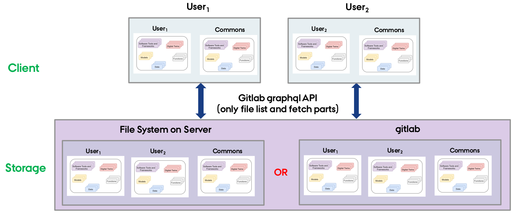

# Host Library Microservice

The library microservice is designed to manage and serve files, functions, and models to users, allowing them to access and interact with various resources.

This document provides instructions for running the library microservice.

## Setup the File System

The users expect the following file system structure for their reusable assets.


## Setup Microservice

To set up the lib microservice, follow these steps:

```sh
git clone https://github.com/INTO-CPS-Association/DTaaS.git
cd DTaaS/server/lib
yarn install   # Install the required dependencies
```

### Environment Variables

To set up the environment variables for the lib microservice, create a new file named _.env_ in the `servers/lib` folder. Then, add the following variables and their respective values. Below you can see and how, with included examples:

```ini
PORT='4001'
MODE='local' or 'gitlab'
LOCAL_PATH='/Users/<Username>/DTaaS/files'
GITLAB_GROUP='dtaas'
GITLAB_URL='https://gitlab.com/api/graphql'
TOKEN='123-sample-token'
APOLLO_PATH='/lib' or ''
GRAPHQL_PLAYGROUND='false' or 'true'
```

Replace the default values the appropriate values for your setup.

**NOTE**:

1. When \__MODE=local_, only _LOCAL_PATH_ is used. Other environment variables are unused.
1. When _MODE=gitlab_, _GITLAB_URL, TOKEN_, and _GITLAB_GROUP_ are used; _LOCAL_PATH_ is unused.

### Start Microservice

```bash
yarn install
yarn build
yarn start
```

The lib microservice is now running and ready to serve files, functions, and models.

Users can access the library microservice at URL: `http://localhost:<PORT>/lib`.


### Modes of Operation

The library microservice hides the mode of operation from the users. The files can come from two sources:

1. A directory on the server machine hosting DTaaS (`mode=local`)
1. A gitlab group on a gitlab instance (`mode=gitlab`). The gitlab can either be a community [gitlab](https://gitlab.com) or your own private gitlab instance.